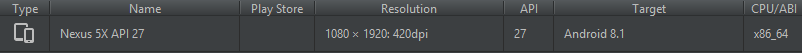
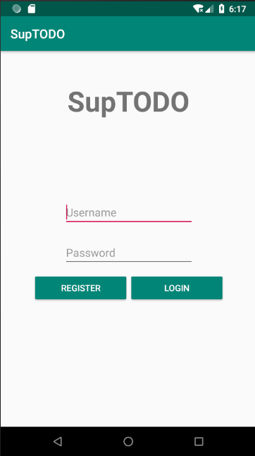
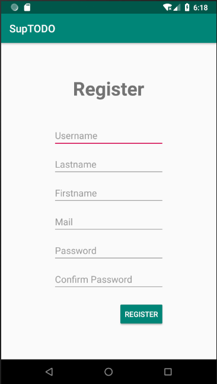
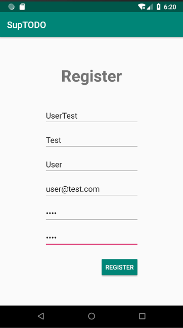
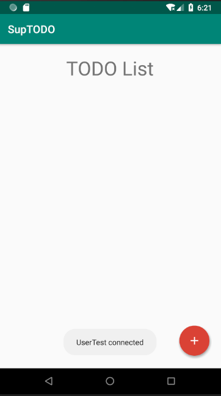
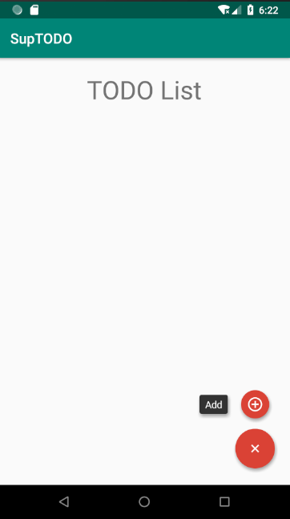
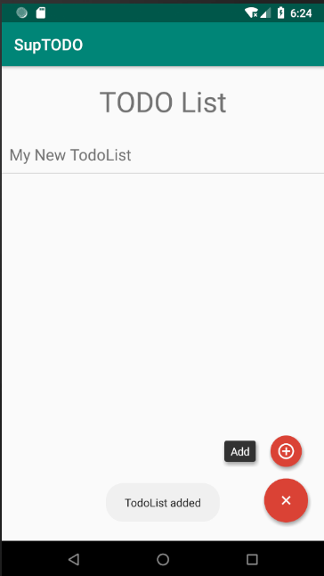
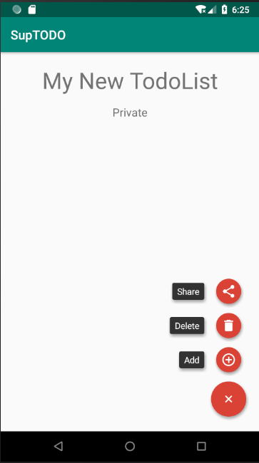

# Bienvenue sur le README de l'application SUPTODO
## Ce document a pour but de vous familiariser avec l'utilisation de l'application et son fonctionnement
<br>
Voici les sujets que nous allons parcourir :
* Configuration de l'environnement
* Lancement de l'application
* Login
* Register
* Les TodoLists
* Les Todos

### Configuration de l'environnement
Pour une utilisation optimale de l'application, il est recommandé d'utiliser l'émulateur suivant :
<br><br>

<br><br>
**Pour être sûr que le projet fonctionne correctement, il est conseillé d'effectuer les instructions suivantes avant de lancer le projet :** <br>
* **Build --> Clean Project**
* **Build --> Build APK**
<br>

L'application utilise une base de données stockée sur le téléphone ainsi qu'une API que nous avons créé de toutes pièces dont les intéractions possibles sont les suivantes :

#### Intéractions avec l'API

Les intéractions avec l'api se font via des requètes POST sur les url suivantes.

#### Utilisateurs

- ```URL/api/all/users``` retourne la liste complête des utilisateurs
- ```URL/api/users/add``` ajoute un utilisateur à la base de données
- ```URL/api/users/login``` connecte un utilisateur
- ```URL/api/users/logout``` déconnecte un utilisateur

#### Todolist

- ```URL/api/all/todolist``` retourne la liste complête des todolists
- ```URL/api/todolist/show``` retourne les todolists d'un utilisateur
- ```URL/api/todolist/read``` retourne les todos d'une todolist
- ```URL/api/todolist/create``` crée une todolist
- ```URL/api/todolist/share``` partage une todolist à un autre utilisateur
- ```URL/api/todolist/delete``` supprime une todolist
- ```URL/api/todolist/update``` met à jour le nom d'une todolist

#### Todo

- ```URL/api/all/todo``` retourne la liste complête des todos
- ```URL/api/todo/show``` retourne un todo
- ```URL/api/todo/delete``` supprime un todo
- ```URL/api/todo/update``` met à jour un todo
- ```URL/api/todo/create``` crée un todo

### Lancement de l'application
Une fois l'application lancée vous vous trouverez devant la vue suivante : <br><br>

<br><br>
Vous aurez donc ici le choix de vous connectez ou bien de créer un nouvel utilisateur (bouton *Register*)
<br>
### Login
C'est sur cette même vue que vous pourrez vous connecter en renseignant votre nom d'utilisateur et votre mot de passe <br><br>

<br>
### Register
Après avoir cliqué sur le bouton *Register*, une nouvelle vue fera son apparition et vous pourrez renseigner les différents champs demandés avant de créer votre utilisateur<br><br>

<br><br>
**Il est important de noter que le bouton de navigation de gauche _(petite flèche)_ permet systématiquement un retour en arrière**
<br><br>
*Une fois l'utilisateur créé, vous serez automatiquement connecté*
<br><br>

<br><br>

### Les TodoLists
Maintenant que vous êtes connecté, une liste de vos TodoLists apparaît dans une nouvelle vue *(liste qui est vide pour le moment)*
<br>
En cliquant sur le bouton "+" en bas à droite de l'écran vous pouvez ajouter une TodoList, qui sera elle aussi, vide
<br><br>

<br><br>
Une fois une liste créée, elle apparaît dans la liste de TodoLists. Un clique gauche sur cette dernière nous permet d'accéder à la liste de ses Todos et un clique gauche long nous permet de modifier son nom
<br><br>

### Les Todos
Après avoir cliqué sur la TodoList, une nouvelle liste apparaît *(elle aussi vide pour le moment)*
<br>
Le bouton "+" permet cette fois-ci d'ajouter un Todo, de supprimer la liste ou de partager la liste avec un autre utilisateur
<br><br>

<br><br>
Désormais, un long clique gauche sur un Todo permet de modifier son nom ou de le supprimer
## Voilà, vous êtes maintenant prêt à utiliser SupTodo
